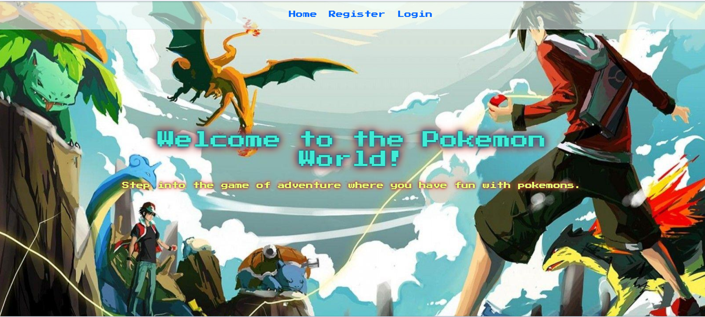
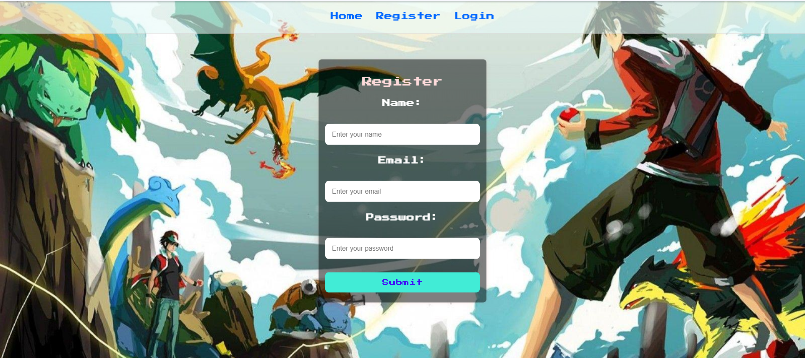
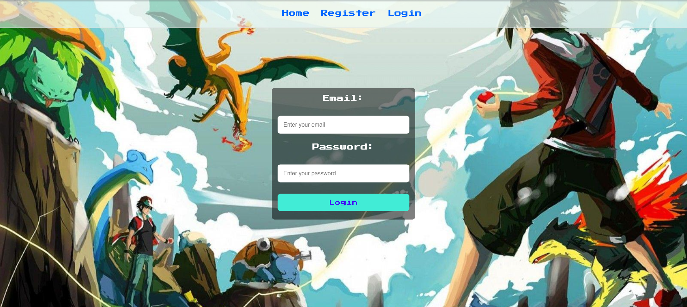
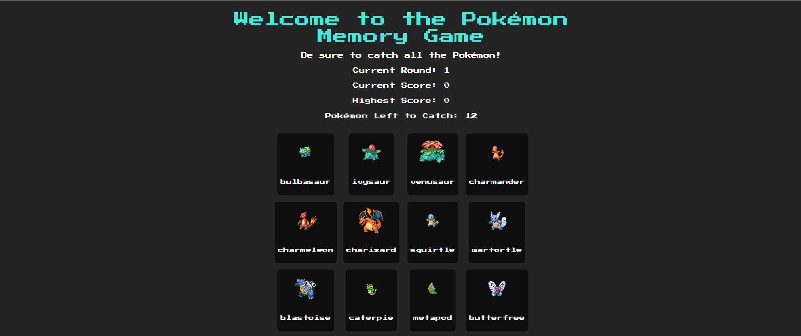

[Pokémon Memory Game](https://pokegame-frontend.onrender.com)

This project is a fun Pokémon Memory Game application built with React, Node.js, and MongoDB. It allows users to register, log in, and play a game where they need to catch Pokémon by clicking on them, without repeating any Pokémon.
In the game, you start with 12 Pokémon to catch in the first round. When you catch them all, the next round increases to 24 Pokémon, making it harder. If you click on a Pokémon you've already caught, the round restarts. Each round becomes more challenging as you progress.

This game is ready to play! Try it out here: [Pokémon Memory Game](https://pokegame-frontend.onrender.com).

## Features

- **User Authentication**: Users can register and log in to access the game.
- **Pokémon Memory Game**: A fun memory game where users need to catch Pokémon by clicking on them without repeating.
- **Responsive UI**: The application is designed to be responsive and user-friendly.
- **Score Tracking**: Users can see their current score, highest score, and progress through different rounds of the game.

## Technologies Used

- **Frontend**:
  - React.js
  - React Router
  - Axios (for API requests)
  - React Hot Toast (for toast notifications)
  
- **Backend**:
  - Node.js
  - Express.js
  - JWT Authentication (JSON Web Tokens)
  - MongoDB (for user data storage)
  - Bcrypt (for password hashing)

- **Other Tools**:
  - MongoDB Atlas (cloud database)
  - CORS (for handling cross-origin requests)
  - Cookie Parser (for handling cookies)

## Prerequisites

Before running the application, you need to have the following installed:

- Node.js (v16+)
- MongoDB (or MongoDB Atlas account for cloud storage)
- npm (or yarn)

## Setup Instructions

### 1. Clone the Repository

git clone https://github.com/ZaaidAhmed/The-PokeGame-.git
cd pokemon-memory-game

### 2. Backend Setup

Navigate to the backend folder and install the dependencies:

cd backend
npm install

Create a .env file in the backend folder and add the following environment variables:

MONGO_URL=your_mongo_database_url
JWT_SECRET=your_jwt_secret_key
PORT=8000

Run the backend server:
npm start

### 3.Frontend Setup
Navigate to the frontend folder and install the dependencies:

cd frontend
npm install
Run the frontend development server:

npm run dev
### 3.Accessing the application
The backend server will be running at http://localhost:8000
The frontend server will be running at http://localhost:5173
Open the frontend in your browser and you should be able to access the login, register, and game pages.

### Website

